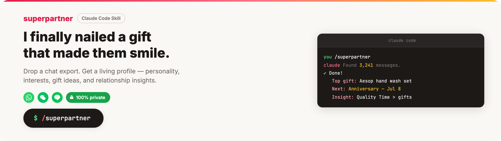

<div align="center">

<br><br>
<p>
  
</p>
<p><em>"I finally nailed a gift that made them smile."</em></p>

<p>
  <a href="https://claude.ai/code"></a>&nbsp;
  <a href="LICENSE"></a>&nbsp;
  <a href="#supported-platforms"></a>&nbsp;
  <a href="#supported-platforms"></a>&nbsp;
  <a href="#supported-platforms"></a>&nbsp;
  <a href="#privacy"></a>
</p>

Drop a chat export. Get a living profile of your partner — personality, interests, important dates, gift ideas, dating plans, and relationship insights. All evidence-based, all from your real conversations.

[Install](#install) · [How It Works](#how-it-works) · [Use Cases](#use-cases) · [Commands](#commands) · [Project Structure](#project-structure) · [Privacy](#privacy) · [**繁體中文**](README_ZH.md)

</div>

---

You know that feeling — their birthday is next week and you're blanking on gift ideas. Or you want to plan a date but can't remember if they mentioned wanting to try that new restaurant or the pottery class. Or you're in a long-distance relationship and running out of creative ways to stay connected.

**superpartner reads your chat history and builds a profile that actually knows your partner.** Not generic "buy flowers" advice — real suggestions grounded in what they've said, what they've shown interest in, and what makes them light up.

---

## Install

**Requirements:** [Claude Code](https://docs.anthropic.com/en/docs/claude-code)

Open Claude Code and paste this:

> Install superpartner: run `git clone https://github.com/coffeeandburger72/superpartner.git ~/.claude/skills/superpartner`

Or run it yourself:

```bash
git clone https://github.com/coffeeandburger72/superpartner.git ~/.claude/skills/superpartner
```

That's it. Then type `/superpartner` in any Claude Code session.

---

## How It Works

```
You:     /superpartner
Claude:  What's your partner's name or nickname?
You:     Sarah
Claude:  How long have you been together, and what stage?
You:     Committed 1 year
Claude:  Drop your chat export file.
You:     ~/Downloads/WhatsApp Chat - Sarah.zip

Claude:  Found 3,241 messages from Jan 1 to Apr 7 between you and Sarah
         on WhatsApp. Proceeding with analysis.

         ... analyzing personality across 6 dimensions ...
         ... mapping interests from messages and photos ...
         ... extracting dates, milestones, and upcoming events ...
         ... building relationship dynamics profile ...

         Done! Here's what I found:

         Personality: INFP — genuinely curious, vents briefly then pivots
         to comfort activities, shares new discoveries with escalating
         enthusiasm over weeks

         Attachment: She needs clear plans and proactive updates to feel
         secure — confirmed details boost her engagement instantly

         Top interests: Ramen, matcha, pottery, film photography,
         cafe hopping, yoga, Studio Ghibli, Japan travel

         Next occasion: Anniversary — Jul 8 (1 year)

         Top gift ideas:
         1. Aesop hand wash set — "i want it so bad but the full set is
            too expensive 😭" (mentioned twice)
         2. Pottery class package — her fastest-growing hobby, goes weekly
         3. Sunset Rollercoaster tickets — "they sound even better live
            than on the album 🤩"

         Key insight: Her #1 love language is Quality Time — a well-planned
         afternoon together has more impact than an expensive gift.

         Use /superpartner gifts sarah, /superpartner dates sarah,
         or /superpartner ask sarah <question> anytime.
```

> [See the full example output →](examples/sarah/)

---

## Use Cases

### "Their birthday is in 2 weeks and I have no idea what to get"

```
/superpartner gifts sarah
```

Regenerates personalized gift ideas based on their interests, wishlist hints from chat, and their love language. Not generic — every suggestion is backed by something they actually said or showed interest in.

---

### "I want to plan something special this weekend"

```
/superpartner dates sarah
```

Generates date ideas tailored to what they enjoy, your relationship stage, and your location. Long-distance? It adapts — virtual movie nights, care packages, countdown activities for your next visit.

---

### "They seemed off lately and I'm not sure why"

```
/superpartner guide sarah
```

Your relationship guide — communication patterns, conflict resolution style, emotional needs, and how to navigate difficult conversations based on how they actually communicate. No textbook advice, just patterns from your real dynamic.

---

### "Do they actually like sushi or am I imagining that?"

```
/superpartner ask sarah do they like sushi?
```

Ask anything about your partner. Answers grounded in profile data with evidence — exact quotes, photo references, and behavioral patterns from your conversations.

---

### "We just had a new trip together and I want to update their profile"

```
/superpartner update sarah
```

Drop a new chat export. The profile merges intelligently — new data enriches existing insights without overwriting. Gift ideas and date plans auto-regenerate with fresh context.

---

### "I don't want to forget their mom's birthday again"

After building a profile, superpartner offers to set up reminders for upcoming occasions — birthdays, anniversaries, trips, events. You get a nudge 2 weeks out and 3 days before, with your top gift pick ready.

---

## Commands

| Command | What it does |
|---------|-------------|
| `/superpartner` | Create a new partner profile from chat export |
| `/superpartner list` | See all profiles at a glance |
| `/superpartner update <name>` | Add new chat data to an existing profile |
| `/superpartner gifts <name>` | Regenerate gift ideas |
| `/superpartner dates <name>` | Regenerate dating plans |
| `/superpartner guide <name>` | Regenerate relationship guide |
| `/superpartner ask <name> <question>` | Ask anything about your partner |
| `/superpartner delete <name>` | Remove a profile completely |

---

## What Gets Generated

For each partner, superpartner creates 6 profile files:

| File | Contents |
|------|----------|
| **persona.md** | Personality across 6 layers — communication style, emotional patterns, values, attachment orientation, with quoted evidence |
| **interests.md** | Categorized interests, food preferences, hobbies, wishlist items — all tagged with how they were detected |
| **occasions.md** | Birthdays, anniversaries, upcoming events, a 90-day gift calendar with prep timelines |
| **gifts.md** | Personalized gift ideas ranked by fit, calibrated to love language and relationship stage |
| **dating_ideas.md** | Date plans organized by type, with LDR adaptations if applicable |
| **relationship_guide.md** | Communication playbook — how to handle tough conversations, emotional needs, what to watch for |

Every finding is evidence-tagged: `(explicit)` from direct statements, `(inferred)` from behavioral patterns, or `(photo)` from image analysis. Profiles are written in the language of your chats.

---

## Project Structure

```
superpartner/
├── SKILL.md                         # Router — entry point invoked by /superpartner
│
├── parsers/                         # Platform-specific chat export parsers
│   ├── whatsapp.md                  #   WhatsApp .zip / .txt (US & UK date formats)
│   ├── wechat.md                    #   WeChat .csv / text exports
│   └── line.md                      #   LINE .txt chat history
│
├── analyzers/                       # Extract structured insights from parsed chat
│   ├── persona_analyzer.md          #   6-layer personality model
│   ├── interests_analyzer.md        #   Interest graph from messages & photos
│   ├── occasions_analyzer.md        #   Date extraction & calendar building
│   └── relationship_analyzer.md     #   7-dimension relationship dynamics
│
├── builders/                        # Generate actionable profile files
│   ├── persona_builder.md           #   → persona.md
│   ├── interests_builder.md         #   → interests.md
│   ├── occasions_builder.md         #   → occasions.md
│   ├── gifts_builder.md             #   → gifts.md
│   ├── dating_ideas_builder.md      #   → dating_ideas.md
│   └── relationship_guide_builder.md#   → relationship_guide.md
│
├── merger.md                        # Incremental update logic for new exports
│
├── partners/                        # Generated profiles (gitignored)
│   └── <slug>/                      #   One folder per partner
│       ├── persona.md
│       ├── interests.md
│       ├── occasions.md
│       ├── gifts.md
│       ├── dating_ideas.md
│       ├── relationship_guide.md
│       └── meta.json                #   Metadata — name, stage, platform, dates
│
├── examples/sarah/                  # Fictional demo profile (committed)
│
└── docs/
    ├── images/                      # Banner images for README
    └── posters/                     # Promotional poster mockups (HTML)
```

### How the pipeline works

```
Chat Export (.zip / .txt / .csv)
        │
        ▼
   ┌─────────┐
   │ Parsers  │  Normalize raw export into structured messages
   └────┬─────┘
        │
        ▼
  ┌───────────┐
  │ Analyzers │  Extract persona, interests, occasions, dynamics
  └─────┬─────┘
        │
        ▼
  ┌───────────┐
  │ Builders  │  Generate evidence-tagged profile files
  └─────┬─────┘
        │
        ▼
  partners/<slug>/   ← Your partner's living profile
```

**Parsers** handle format differences across platforms — WhatsApp locale variants, WeChat CSV quirks, LINE timestamp formats. They output a normalized message stream.

**Analyzers** run in parallel over the message stream. Each analyzer focuses on one domain (personality, interests, dates, or relationship dynamics) and produces structured findings with evidence tags.

**Builders** take analyzer output and write the final profile files. Each builder owns one output file and formats it for readability — section headers stay English, but content is written in the detected chat language.

**Merger** handles incremental updates when you add a new chat export. It diffs new findings against existing profiles, preserves manually curated entries, and triggers builders to regenerate derived files (gifts, dates) with fresh context.

---

## Supported Platforms

| Platform | Export Format | How to Export |
|----------|-------------|---------------|
| **WhatsApp** | `.zip` | Chat > More > Export Chat (with media) |
| **WeChat** | `.csv` or text | Use third-party export tools |
| **LINE** | `.txt` | Settings > Chats > Export Chat History |
| **Any platform** | Pasted text | Copy-paste conversation directly |

---

## Privacy

Your data stays on your machine. Always.

- All partner profiles are stored locally in `partners/` and gitignored by default
- Chat exports are never committed, uploaded, or sent anywhere
- No telemetry, no analytics, no cloud sync
- `delete` command fully removes all traces — profile files, scheduled reminders, and memory entries

---

## License

MIT. Free forever.
