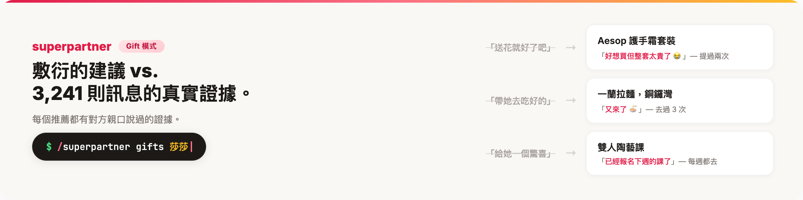
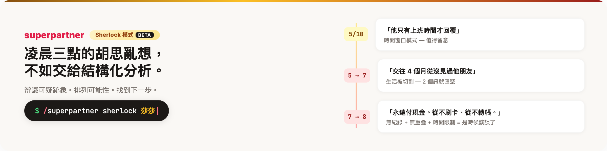

<div align="center">

<br><br>
<p>
  
</p>
<p><em>「我終於送了一份對方真正想要的禮物。」</em></p>

<p>
  <a href="https://claude.ai/code"></a>&nbsp;
  <a href="LICENSE"></a>&nbsp;
  <a href="#支援平台"></a>&nbsp;
  <a href="#支援平台"></a>&nbsp;
  <a href="#支援平台"></a>&nbsp;
  <a href="#隱私保護"></a>
</p>

匯入一份聊天紀錄，建立你伴侶的完整檔案 — 性格分析、興趣圖譜、重要日子、禮物推薦、約會企劃、關係洞察。所有建議都來自你們的真實對話，有根有據。

[安裝](#安裝) · [運作方式](#運作方式) · [使用情境](#使用情境) · [指令一覽](#指令一覽) · [專案結構](#專案結構) · [隱私保護](#隱私保護) · [**English**](README.md)

</div>

---

你一定經歷過 — 對方的生日下週就到，腦袋一片空白。想約對方出去，但忘了對方到底是想試那間新餐廳還是陶藝班。又或者你們異地戀，快要想不到新花樣了。

**superpartner 讀你們的聊天紀錄，建立一個真正了解對方的檔案。** 不是敷衍的「送花就好」，而是根據對方說過的話、展現過的興趣、讓對方眼睛發亮的事物，給出實在的建議。

---

## 安裝

**需要：** [Claude Code](https://docs.anthropic.com/en/docs/claude-code)

打開 Claude Code，貼上這段：

> Install superpartner: run `git clone https://github.com/coffeeandburger72/superpartner.git ~/.claude/skills/superpartner`

或自己執行：

```bash
git clone https://github.com/coffeeandburger72/superpartner.git ~/.claude/skills/superpartner
```

完成。在任何 Claude Code 對話中輸入 `/superpartner` 即可使用。

**自動更新：** 每次啟動 Claude Code 時，superpartner 會自動拉取最新版本，無需手動更新。

---

## 運作方式

```
你：     /superpartner
Claude:  你伴侶叫什麼名字？
你：     莎莎
Claude:  你們在一起多久，目前什麼階段？
你：     交往一年
Claude:  請提供聊天紀錄檔案。
你：     ~/Downloads/WhatsApp Chat - 莎莎.zip

Claude:  找到 3,241 則訊息，日期從 1 月 1 日到 4 月 7 日，
         平台為 WhatsApp。開始分析。

         ... 分析 6 個維度的性格特徵 ...
         ... 從訊息和相片中提取興趣 ...
         ... 擷取日期、里程碑和即將到來的活動 ...
         ... 建立關係動態分析 ...

         完成！以下是重點發現：

         性格：INFP — 真心好奇、壓力大時先抒發再轉向舒壓活動、
         發現新事物後會持續分享數週且熱情遞增

         依附傾向：她需要明確的計劃和主動的回報才能感到安心 —
         確認細節後她的參與度會立即提升

         主要興趣：拉麵、抹茶、陶藝、底片攝影、
         咖啡店探索、瑜伽、宮崎駿、日本旅行

         下個重要日子：交往一週年紀念日（7 月 8 日）

         禮物推薦：
         1. Aesop 護手霜組合 — 「好想買但整套太貴了 😭」
           （提過兩次）
         2. 陶藝課程套票 — 她成長最快的興趣，每週都去上課
         3. 落日飛車演唱會門票 — 「他們現場比錄音室版還好聽 🤩」

         核心洞察：她的首要愛之語言是精心時刻 — 一個用心安排
         的下午比昂貴的禮物更有意義。

         隨時可用 /superpartner gifts 莎莎、/superpartner dates 莎莎
         或 /superpartner ask 莎莎 <問題> 查詢更多。
```

> [查看完整範例輸出 →](examples/sarah/)

---

## 使用情境

### 「對方生日快到了，完全不知道該買什麼」



```
/superpartner gifts 莎莎
```

根據對方的興趣、聊天中提過的願望清單、以及對方的愛之語言，重新生成個人化禮物建議。每個推薦都有對方親口說過或展示過興趣的證據。

---

### 「這個週末想安排一些特別的」

```
/superpartner dates 莎莎
```

根據對方的喜好、你們的關係階段和所在地生成約會提案。異地戀？自動調整 — 線上電影之夜、寄送驚喜包裹、下次見面的倒數活動。

---

### 「最近覺得對方怪怪的，不知道為什麼」

```
/superpartner guide 莎莎
```

你的關係指南 — 溝通模式、衝突處理風格、情緒需求，以及如何根據對方的實際溝通方式來處理敏感對話。不是教科書建議，是從你們真實互動中提煉的模式。

---

### 「總覺得哪裡不對勁，但不確定是不是自己想太多」 `beta`



```
/superpartner sherlock 莎莎
```

描述你觀察到的情況 — 行為改變、一段令人困惑的對話、一種直覺。Sherlock 幫你整理事實，將可能性從最無害到最需要警惕排列，並給出一個隨著你補充更多細節而動態更新的警示指數。不下結論、不製造恐慌 — 只給你清晰的思路和冷靜的下一步。

---

### 「對方到底喜不喜歡吃壽司？」

```
/superpartner ask 莎莎 對方喜歡吃壽司嗎？
```

問任何關於你伴侶的問題。回答基於檔案數據，附上證據 — 原文引用、相片參考、對話中的行為模式。

---

### 「我們剛旅行回來，想更新對方的檔案」

```
/superpartner update 莎莎
```

匯入新的聊天紀錄。檔案會智能合併 — 新數據豐富現有分析，不會覆蓋舊結論。禮物推薦和約會企劃自動根據新資料重新生成。

---

### 「不想再忘記對方家人的生日」

建立檔案後，superpartner 會提供即將到來的日子的提醒設定 — 生日、紀念日、旅行、活動。提前兩週和三天前各收到一次提醒，附上首選禮物建議。

---

## 指令一覽

| 指令 | 功能 |
|------|------|
| `/superpartner` | 從聊天紀錄建立新的伴侶檔案 |
| `/superpartner list` | 查看所有檔案 |
| `/superpartner update <名>` | 用新聊天紀錄更新現有檔案 |
| `/superpartner gifts <名>` | 重新生成禮物建議 |
| `/superpartner dates <名>` | 重新生成約會企劃 |
| `/superpartner guide <名>` | 重新生成關係指南 |
| `/superpartner ask <名> <問題>` | 問任何關於伴侶的問題 |
| `/superpartner sherlock <名>` | **`beta`** 關係警訊分析 — 辨識欺瞞、出軌、詐騙等可疑跡象 |
| `/superpartner delete <名>` | 完全刪除檔案 |

---

## 生成內容

每位伴侶會建立 6 個檔案：

| 檔案 | 內容 |
|------|------|
| **persona.md** | 6 層性格分析 — 溝通風格、情緒模式、價值觀、依附傾向，附原文引用 |
| **interests.md** | 分類整理的興趣、飲食偏好、嗜好、願望清單 — 每項標註發現方式 |
| **occasions.md** | 生日、紀念日、即將到來的活動、90 天禮物行事曆附準備時程 |
| **gifts.md** | 個人化禮物推薦，按契合度排名，根據愛之語言和關係階段調整 |
| **dating_ideas.md** | 按類型分類的約會企劃，異地戀有專屬方案 |
| **relationship_guide.md** | 溝通手冊 — 如何處理困難對話、情緒需求、需要注意的地方 |

每項發現都有證據標記：`(explicit)` 直接陳述、`(inferred)` 行為模式推斷、`(photo)` 相片分析。檔案以聊天語言撰寫。

---

## 專案結構

```
superpartner/
├── SKILL.md                         # 路由器 — /superpartner 的進入點
│
├── parsers/                         # 各平台聊天紀錄解析器
│   ├── whatsapp.md                  #   WhatsApp .zip / .txt（美式及英式日期格式）
│   ├── wechat.md                    #   WeChat .csv / 文字匯出
│   └── line.md                      #   LINE .txt 聊天紀錄
│
├── analyzers/                       # 從解析後的聊天紀錄中提取結構化洞察
│   ├── persona_analyzer.md          #   6 層性格模型
│   ├── interests_analyzer.md        #   從訊息和相片建立興趣圖譜
│   ├── occasions_analyzer.md        #   日期提取與行事曆建立
│   └── relationship_analyzer.md     #   7 維度關係動態分析
│
├── builders/                        # 生成可操作的檔案
│   ├── persona_builder.md           #   → persona.md
│   ├── interests_builder.md         #   → interests.md
│   ├── occasions_builder.md         #   → occasions.md
│   ├── gifts_builder.md             #   → gifts.md
│   ├── dating_ideas_builder.md      #   → dating_ideas.md
│   └── relationship_guide_builder.md#   → relationship_guide.md
│
├── merger.md                        # 新匯出的增量更新邏輯
├── sherlock.md                      # Sherlock 模式（beta）關係警訊分析
│
├── partners/                        # 生成的檔案（已加入 gitignore）
│   └── <slug>/                      #   每位伴侶一個資料夾
│       ├── persona.md
│       ├── interests.md
│       ├── occasions.md
│       ├── gifts.md
│       ├── dating_ideas.md
│       ├── relationship_guide.md
│       └── meta.json                #   元數據 — 名字、階段、平台、日期
│
├── examples/sarah/                  # 虛構範例檔案（已提交至 git）
│
├── .claude/
│   └── settings.json                # 自動更新 hook — 每次啟動時拉取最新版本
│
└── docs/
    └── images/                      # README 用的橫幅圖片
```

### 流水線運作方式

```
聊天紀錄匯出（.zip / .txt / .csv）
        │
        ▼
   ┌──────────┐
   │  解析器   │  將原始匯出標準化為結構化訊息
   └────┬──────┘
        │
        ▼
  ┌───────────┐
  │  分析器    │  提取性格、興趣、日期、關係動態
  └─────┬─────┘
        │
        ▼
  ┌───────────┐
  │  建構器    │  生成帶有證據標記的檔案
  └─────┬─────┘
        │
        ▼
  partners/<slug>/   ← 你伴侶的活檔案
```

**解析器** 處理各平台的格式差異 — WhatsApp 的地區日期格式、WeChat CSV 格式特性、LINE 的時間戳格式。輸出標準化的訊息流。

**分析器** 平行處理訊息流。每個分析器專注於一個領域（性格、興趣、日期或關係動態），產出帶有證據標記的結構化發現。

**建構器** 接收分析器的輸出，寫入最終的檔案。每個建構器負責一個輸出檔案，以易讀格式排版 — 段落標題保持英文，但內容以偵測到的聊天語言撰寫。

**合併器** 處理新聊天紀錄的增量更新。它比對新發現與現有檔案的差異，保留手動修改的條目，並觸發建構器以新資料重新生成衍生檔案（禮物、約會）。

---

## 支援平台

| 平台 | 匯出格式 | 匯出方式 |
|------|---------|---------|
| **WhatsApp** | `.zip` | 對話 > 更多 > 匯出對話（含媒體）|
| **WeChat** | `.csv` 或文字 | 使用第三方匯出工具 |
| **LINE** | `.txt` | 設定 > 聊天 > 備份聊天紀錄 |
| **任何平台** | 貼上文字 | 直接複製貼上對話內容 |

---

## 隱私保護

你的數據永遠留在你的電腦上。

- 所有伴侶檔案儲存在本地 `partners/` 資料夾，預設已加入 gitignore
- 聊天紀錄絕不會被提交、上傳或傳送到任何地方
- 無遙測、無分析追蹤、無雲端同步
- `delete` 指令徹底清除所有痕跡 — 檔案、排程提醒、記憶條目

---

## 授權

MIT 授權。永久免費。
